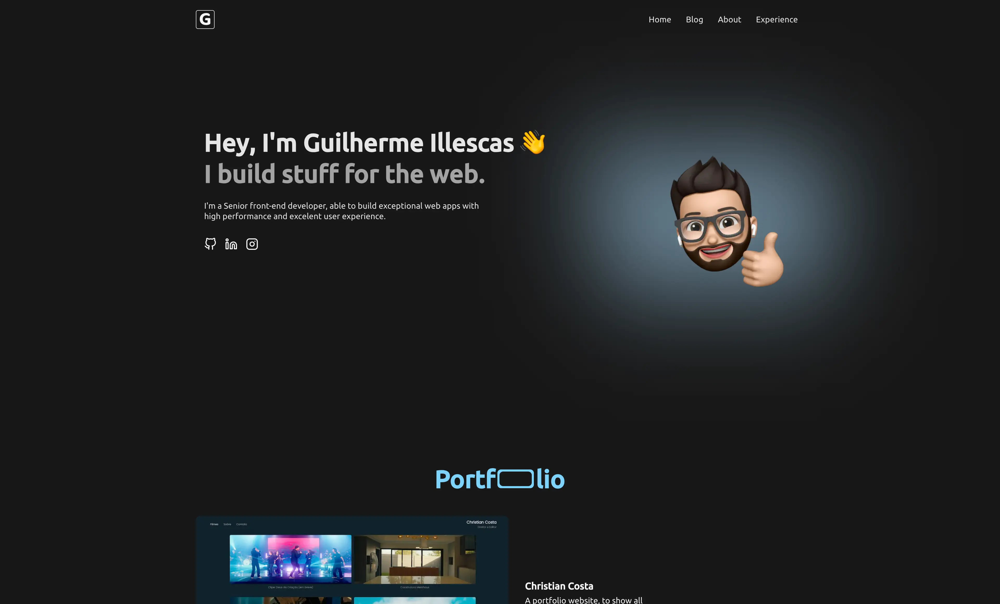

<p align="center">
  
</p>


# My website
Here you cand find the source code of my own website.


# 🚀 Techs:
- Next.js
- TypeScript
- SSG and SSR
- HTML an CSS
- CMS (Strapi)
- GraphQL
- Styled-components
- Jest and Testing Library for tests
- Code quality using ESLint, Prettier and editor config


# 🤔 How do you download the code and test in your own machine?

```bash
1. You must have Node.js and Git installed on your machine


2. Clone this repo. To do so, create a folder on your computer, open the bash terminal and run the comand:

git clone https://github.com/guiillescas/guilles-site-2


3. Run the code bellow to entry in the directory:

cd guilles-site-2

4. Create a .env file in the root folder, and set up the environments.


5. Then, install the dependecies, running:

yarn
# or
npm install


6. Run the server:

yarn dev
# or
npm run dev


7. On your browser, run:

http://localhost:3000
```

